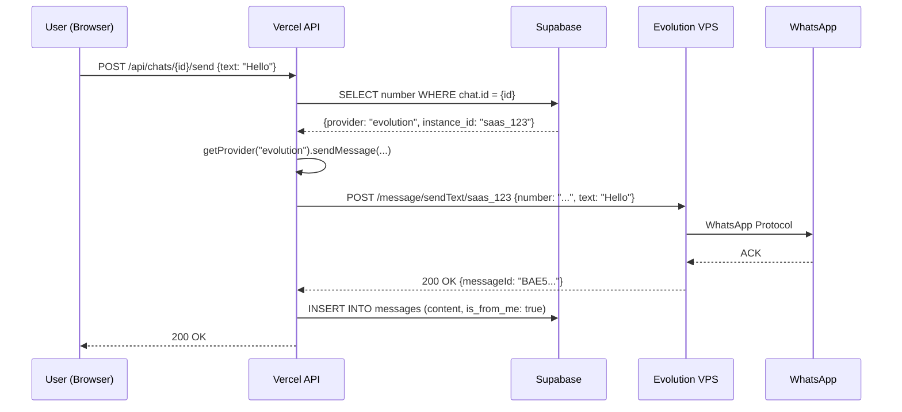

# System Architecture: Evolution API Integration

> [!NOTE]
> This document defines the architectural blueprint for integrating a self-hosted WhatsApp provider (Evolution API) alongside the existing SaaS provider (GreenAPI).

## 1. High-Level Architecture
We will implement a **Gateway Pattern** (Provider Abstraction Layer) to decouple the SaaS core logic from specific WhatsApp providers. This allows the backend to switch between "Cloud Hosted" (GreenAPI) and "Self Hosted" (Evolution API) transparently.

```mermaid
graph TD
    User[End User (Browser)] -->|Manage Numbers| Vercel[Vercel Backend API]
    User -->|Scan QR| Vercel
    
    subgraph "SaaS Infrastructure (Vercel)"
        Vercel -->|Auth & Logic| DB[(Supabase Postgres)]
        Vercel -->|Gateway Layer| ProviderAdapter
    end
    
    subgraph "Provider 1: GreenAPI (SaaS)"
        ProviderAdapter -->|HTTP| GreenAPI[GreenAPI Cloud]
    end
    
    subgraph "Provider 2: Evolution API (Self-Hosted)"
        ProviderAdapter -->|HTTP / Secure| VPS[Your VPS / Docker]
        VPS -->|Evolution Container| EvoDB[(Evolution Postgres)]
        VPS -->|Whatsapp Protocol| WA[WhatsApp Servers]
    end

    WA -->|Webhook| VPS
    VPS -->|Signed Webhook| Vercel
    GreenAPI -->|Webhook| Vercel
```

## 2. Component Design

### 2.1 The Gateway Layer (`ProviderAdapter`)
A cohesive interface that normalizes differences between providers.
**Interface Definitions:**
- `createInstance(configs)`: Provisions the number.
- `connect(instanceId)`: Returns connection data (QR Code / Pairing Code).
- `disconnect(instanceId)`: Logs out the session.
- `sendMessage(to, content, options)`: Sends text, media, or templates.
- `normalizeWebhook(payload)`: Converts provider-specific payloads into a standardized internal event.

### 2.2 Evolution API "Black Box"
We treat the self-hosted Evolution API instance as a trusted external service, similar to a paid API.
- **Hosting**: Docker Compose (Postgres + Redis + Node.js API).
- **Security**:
    - **Global API Key**: Stored in Vercel `EVOLUTION_GLOBAL_API_KEY`. Used for administrative tasks (Create/Delete Instance).
    - **Instance API Key**: Generated per number. Stored in Supabase `numbers.instance_data`. Used for sending messages.
- **Persistence**: Postgres ensures sessions survive container restarts.

## 3. Data Design

### 3.1 Database Schema Extensions
We avoid creating new tables where possible, opting for polymorphic columns.

#### Table: `public.numbers`
| Column | Type | Description |
| :--- | :--- | :--- |
| `provider` | `text` | Enum: `green-api` (default), `evolution`. |
| `instance_id` | `text` | The unique ID on the provider side. <br>Green: `1101...` <br>Evolution: `saas_user_123_random` |
| `api_token` | `text` | The authentication token for this specific number. |
| `settings` | `jsonb` | **New**: Provider-specific metadata. <br>`{ "webhook_url": "...", "integration_id": "..." }` |

### 3.2 Data Normalization
Evolution and GreenAPI return different message structures. We must normalize them *before* saving to our `messages` table.

**Internal Message Format (Target):**
```json
{
  "remoteJid": "1234567890@s.whatsapp.net",
  "fromMe": false,
  "id": "BAE5...",
  "timestamp": 1700000000,
  "type": "text",
  "content": { "text": "Hello World" }
}
```

**Normalization Strategy:**
- **GreenAPI**: Maps `typeMessage` -> `type`. content is deeply nested in `messageData`.
- **Evolution**: Maps `messageType` -> `type`. Content is found in `message.conversation` or `message.extendedTextMessage`.

## 4. Security & Trust

### 4.1 Inbound Security (Webhooks)
Since Evolution runs on your VPS, we must ensure **only your VPS** can trigger webhooks on your Vercel backend.
- **Mechanism**: HMAC-SHA256 Signature.
- **Flow**:
    1. Evolution sends `POST /api/webhooks/evolution`.
    2. Headers include `HTTP_EVOX_SIGNATURE` (signed with your Global Key).
    3. Vercel middleware re-computes hash of `body`.
    4. If hash mismatch -> **403 Forbidden**.

### 4.2 Outbound Security (API Calls)
- **Vercel -> Evolution**: All traffic MUST go over HTTPS.
- **API Key**: The `GLOBAL_API_KEY` is injected only at build/runtime in Vercel. It is never exposed to the client.

## 5. Implementation Roadmap (Revised)

1.  **Phase 1: Foundation**
    -   Deploy "Evolution" Docker stack (Postgres/Redis).
    -   Update Supabase Schema (`provider` column).
2.  **Phase 2: Backend Core**
    -   Implement `EvolutionProvider` class with `fetch` wrappers.
    -   Implement HMAC verification middleware.
3.  **Phase 3: Frontend**
    -   Add "Provider Selector" in UI.
    -   Adapt QR Code view (Base64 rendering for Evolution).
4.  **Phase 4: Migration**
    -   (Optional) Script to migrate existing numbers if needed (unlikely for now).

## 6. API Specifications & Contracts

### 6.1 Evolution API Endpoints

#### Instance Management
```typescript
// POST /instance/create
Request: {
  instanceName: string,  // Format: saas_{user_id}_{random}
  token?: string,        // Optional instance-specific token
  qrcode: boolean,       // true to generate QR
  integration: "WHATSAPP-BAILEYS"
}
Response: {
  instance: { instanceName: string },
  hash: { apikey: string },  // Store this in numbers.api_token
  qrcode?: { base64: string }
}

// GET /instance/connect/{instanceName}
Response: {
  base64: string,  // QR Code image
  code: string     // Pairing code (alternative)
}

// DELETE /instance/delete/{instanceName}
Response: { status: "success" }

// POST /message/sendText/{instanceName}
Request: {
  number: string,  // Format: 1234567890 (no @s.whatsapp.net)
  text: string
}

// POST /message/sendMedia/{instanceName}
Request: {
  number: string,
  mediatype: "image" | "video" | "document" | "audio",
  media: string,  // URL or base64
  caption?: string
}
```

#### Webhook Events
```typescript
// CONNECTION_UPDATE
{
  event: "connection.update",
  instance: string,
  data: {
    state: "open" | "close" | "connecting",
    statusReason?: number  // Baileys DisconnectReason
  }
}

// MESSAGES_UPSERT (Incoming Message)
{
  event: "messages.upsert",
  instance: string,
  data: {
    key: {
      remoteJid: string,
      fromMe: boolean,
      id: string
    },
    message: {
      conversation?: string,
      extendedTextMessage?: { text: string },
      imageMessage?: { url: string, caption?: string },
      // ... other Baileys message types
    },
    messageTimestamp: number
  }
}
```

### 6.2 GreenAPI Endpoints (For Comparison)
```typescript
// POST /waInstance{instanceId}/sendMessage/{apiToken}
Request: {
  chatId: "1234567890@c.us",
  message: string
}

// Webhook payload differs significantly - requires normalization
```

## 7. Error Handling & Resilience

### 7.1 HTTP Error Codes
| Code | Meaning | Recovery Strategy |
| :--- | :--- | :--- |
| `400` | Bad Request (malformed payload) | Log error, return to user with validation message |
| `401` | Unauthorized (invalid API key) | Alert admin, check env vars |
| `404` | Instance not found | Sync DB state, mark number as "disconnected" |
| `408/504` | Timeout | Retry with exponential backoff (max 3 attempts) |
| `429` | Rate limit exceeded | Queue request, retry after `Retry-After` header |
| `500` | Internal server error | Log, alert monitoring, retry once after 5s |

### 7.2 Baileys-Specific Errors
Evolution API uses Baileys under the hood. Key disconnect reasons:
- `DisconnectReason.loggedOut` (403): User logged out → Delete instance, notify user
- `DisconnectReason.restartRequired` (515): Restart needed → Auto-reconnect
- `DisconnectReason.connectionLost` (408): Network issue → Retry connection
- `DisconnectReason.badSession` (440): Session corrupted → Force re-QR

### 7.3 Resilience Patterns

#### Circuit Breaker
```javascript
class EvolutionCircuitBreaker {
  constructor() {
    this.failures = 0
    this.threshold = 5
    this.timeout = 60000 // 1 min
    this.state = 'CLOSED' // CLOSED, OPEN, HALF_OPEN
  }
  
  async call(fn) {
    if (this.state === 'OPEN') {
      if (Date.now() - this.openedAt > this.timeout) {
        this.state = 'HALF_OPEN'
      } else {
        throw new Error('Circuit breaker is OPEN')
      }
    }
    
    try {
      const result = await fn()
      this.onSuccess()
      return result
    } catch (error) {
      this.onFailure()
      throw error
    }
  }
}
```

#### Retry with Exponential Backoff
```javascript
async function retryWithBackoff(fn, maxRetries = 3) {
  for (let i = 0; i < maxRetries; i++) {
    try {
      return await fn()
    } catch (error) {
      if (i === maxRetries - 1) throw error
      if (error.status === 400 || error.status === 401) throw error // Don't retry client errors
      
      const delay = Math.min(1000 * Math.pow(2, i), 10000)
      await new Promise(resolve => setTimeout(resolve, delay))
    }
  }
}
```

#### Webhook Deduplication
```javascript
// Use Redis to track processed webhook IDs
const WEBHOOK_TTL = 3600 // 1 hour

async function isWebhookProcessed(messageId) {
  const key = `webhook:${messageId}`
  const exists = await redis.exists(key)
  if (exists) return true
  
  await redis.setex(key, WEBHOOK_TTL, '1')
  return false
}
```

## 8. Monitoring & Observability

### 8.1 Metrics to Track
- **Instance Health**: Active vs. disconnected instances
- **Message Throughput**: Messages sent/received per minute
- **Error Rates**: 4xx/5xx errors by endpoint
- **Webhook Latency**: Time from Evolution event to DB write
- **Session Stability**: Reconnection frequency per instance

### 8.2 Logging Strategy
```javascript
// Structured logging format
{
  timestamp: "2026-01-11T14:35:00Z",
  level: "error",
  service: "evolution-provider",
  instance: "saas_abc123_xyz",
  operation: "sendMessage",
  error: {
    code: 500,
    message: "Internal server error",
    stack: "..."
  },
  context: {
    userId: "uuid",
    numberId: "uuid",
    recipient: "1234567890"
  }
}
```

### 8.3 Health Check Endpoint
```javascript
// GET /api/health/evolution
Response: {
  status: "healthy" | "degraded" | "down",
  vps: {
    reachable: boolean,
    responseTime: number,
    version: string
  },
  instances: {
    total: number,
    connected: number,
    disconnected: number
  },
  lastCheck: "2026-01-11T14:35:00Z"
}
```

## 9. Edge Cases & Failure Modes

### 9.1 VPS Downtime
**Scenario**: Evolution API server crashes or becomes unreachable.
**Impact**: Cannot send messages, cannot provision new numbers.
**Mitigation**:
- Frontend shows "Provider temporarily unavailable" banner
- Queue outbound messages in Supabase `outbox` table
- Vercel Cron (every 5 min) checks VPS health, retries queued messages when back online

### 9.2 Database Desync
**Scenario**: User deletes instance via Evolution API directly (bypassing our backend).
**Impact**: Our DB shows "active" but Evolution returns 404.
**Mitigation**:
- Daily sync job: `GET /instance/fetchInstances` → compare with DB → mark orphans as "disconnected"
- On 404 error during message send → auto-mark as disconnected, notify user

### 9.3 WhatsApp Ban
**Scenario**: WhatsApp detects automation and bans the number.
**Impact**: Instance shows "open" but messages fail silently.
**Mitigation**:
- Monitor for repeated send failures (e.g., 10 consecutive 500s)
- Auto-pause instance, send email alert to user
- Provide "Appeal" flow in UI

### 9.4 Concurrent QR Scans
**Scenario**: User opens "Add Number" in two browser tabs, both generate QR codes.
**Impact**: Race condition - which scan wins?
**Mitigation**:
- Use DB row lock: `SELECT ... FOR UPDATE` on `numbers` table during provisioning
- Only one instance creation allowed per user at a time

### 9.5 Session Expiry During Inactivity
**Scenario**: Number inactive for 30+ days, Baileys session expires.
**Impact**: Connection drops, requires re-QR.
**Mitigation**:
- Vercel Cron sends "keepalive" message to self every 7 days for inactive instances
- On `CONNECTION_UPDATE: close` → notify user via email to re-scan QR

## 10. Security Hardening

### 10.1 Webhook Signature Verification (Detailed)
```javascript
import crypto from 'crypto'

function verifyEvolutionWebhook(req) {
  const signature = req.headers['http_evox_signature']
  const timestamp = req.headers['http_evox_time']
  const body = JSON.stringify(req.body)
  
  // Prevent replay attacks (5 min window)
  const now = Math.floor(Date.now() / 1000)
  if (Math.abs(now - parseInt(timestamp)) > 300) {
    throw new Error('Webhook timestamp too old')
  }
  
  // Compute expected signature
  const payload = `${timestamp}.${body}`
  const expectedSig = crypto
    .createHmac('sha256', process.env.EVOLUTION_GLOBAL_API_KEY)
    .update(payload)
    .digest('hex')
  
  // Constant-time comparison
  if (!crypto.timingSafeEqual(Buffer.from(signature), Buffer.from(expectedSig))) {
    throw new Error('Invalid webhook signature')
  }
  
  return true
}
```

### 10.2 Rate Limiting (Vercel Side)
```javascript
// Use Vercel KV or Upstash Redis
import { Ratelimit } from '@upstash/ratelimit'

const ratelimit = new Ratelimit({
  redis: Redis.fromEnv(),
  limiter: Ratelimit.slidingWindow(10, '10 s'), // 10 req per 10s per IP
})

export default async function handler(req, res) {
  const identifier = req.headers['x-forwarded-for'] || 'anonymous'
  const { success } = await ratelimit.limit(identifier)
  
  if (!success) {
    return res.status(429).json({ error: 'Too many requests' })
  }
  // ... rest of handler
}
```

### 10.3 Environment Variable Security
```bash
# .env.local (Vercel)
EVOLUTION_API_URL=https://wa.yoursaas.com
EVOLUTION_GLOBAL_API_KEY=your-secret-key-here  # Never commit to git
EVOLUTION_WEBHOOK_SECRET=different-secret-for-hmac
```

## 11. Data Flow Diagrams

### 11.1 Provisioning Flow
```mermaid
sequenceDiagram
    participant U as User (Browser)
    participant V as Vercel API
    participant DB as Supabase
    participant E as Evolution VPS
    
    U->>V: POST /api/numbers/create {provider: "evolution"}
    V->>DB: INSERT INTO numbers (status: "provisioning")
    V->>E: POST /instance/create {instanceName: "saas_123_abc"}
    E-->>V: {apikey: "xyz", qrcode: {base64: "..."} }
    V->>DB: UPDATE numbers SET api_token="xyz", status="pending_qr"
    V-->>U: {qrCode: "data:image/png;base64,..."}
    
    Note over U: User scans QR with phone
    
    E->>V: Webhook: CONNECTION_UPDATE {state: "open"}
    V->>DB: UPDATE numbers SET status="active"
    V-->>E: 200 OK
```

### 11.2 Message Send Flow


## 12. Implementation Checklist (Detailed)

### Phase 1: Infrastructure (Week 1)
- [ ] Provision VPS (4GB RAM, Ubuntu 22.04)
- [ ] Install Docker & Docker Compose
- [ ] Deploy Evolution stack with Postgres/Redis
- [ ] Configure Caddy/Nginx for SSL (Let's Encrypt)
- [ ] Test health endpoint accessibility
- [ ] Set up Vercel environment variables

### Phase 2: Database (Week 1)
- [ ] Write migration: Add `provider` column to `numbers`
- [ ] Write migration: Add `instance_data` JSONB column
- [ ] Create indexes: `numbers(provider)`, `numbers(status)`
- [ ] Test migration on staging Supabase
- [ ] Deploy to production

### Phase 3: Backend Core (Week 2-3)
- [ ] Create `api/_utils/providers/base.js` (abstract class)
- [ ] Implement `api/_utils/providers/evolution.js`
  - [ ] `createInstance()`
  - [ ] `connect()`
  - [ ] `disconnect()`
  - [ ] `sendTextMessage()`
  - [ ] `sendMediaMessage()`
- [ ] Implement `api/_utils/providers/greenapi.js` (refactor existing)
- [ ] Create `api/_utils/providers/index.js` (factory)
- [ ] Implement `api/v1/webhooks/evolution.js`
  - [ ] HMAC verification middleware
  - [ ] `CONNECTION_UPDATE` handler
  - [ ] `MESSAGES_UPSERT` handler
  - [ ] Normalization logic
- [ ] Update `api/v1/numbers.js` to use provider factory
- [ ] Update `api/v1/chats/[id]/send.js` to use provider factory

### Phase 4: Frontend (Week 3)
- [ ] Add provider selector to "Add Number" modal
- [ ] Create `QRCodeDisplay.jsx` component
- [ ] Implement polling for connection status
- [ ] Update number list to show provider badge
- [ ] Add "Reconnect" button for disconnected Evolution numbers

### Phase 5: Monitoring (Week 4)
- [ ] Create `api/health/evolution.js` endpoint
- [ ] Set up Vercel Cron for health checks (every 5 min)
- [ ] Implement structured logging (Vercel Log Drains → Datadog/Logtail)
- [ ] Create admin dashboard for instance health
- [ ] Set up alerting (email on VPS down)

### Phase 6: Testing (Week 4)
- [ ] Unit tests for provider classes
- [ ] Integration tests for webhook handling
- [ ] Load test: 100 concurrent message sends
- [ ] Chaos test: Kill VPS mid-operation, verify recovery
- [ ] Security test: Attempt webhook spoofing

### Phase 7: Documentation (Week 4)
- [ ] Update API docs with Evolution endpoints
- [ ] Write deployment guide for VPS setup
- [ ] Create troubleshooting runbook
- [ ] Document cost analysis (VPS vs. GreenAPI)

## 13. Cost & Performance Analysis

### 13.1 Infrastructure Costs
| Component | Provider | Cost/Month |
| :--- | :--- | :--- |
| VPS (4GB RAM) | Hetzner | $5 |
| VPS (8GB RAM, recommended for 50+ instances) | Hetzner | $10 |
| SSL Certificate | Let's Encrypt | $0 |
| **Total** | | **$5-10** |

**vs. GreenAPI**: ~$20/month per number

**Break-even**: 1-2 numbers

### 13.2 Performance Benchmarks
- **Message Send Latency**: 
  - GreenAPI: ~500ms (cloud roundtrip)
  - Evolution: ~200ms (direct VPS connection)
- **Max Instances per VPS**:
  - 4GB RAM: ~20 instances
  - 8GB RAM: ~50 instances
- **Webhook Processing**: <100ms (with Redis deduplication)

## 14. Migration Strategy (Future)

If you decide to migrate existing GreenAPI numbers to Evolution:

1. **No Automatic Migration**: Users must re-scan QR (WhatsApp limitation)
2. **Gradual Rollout**: Offer Evolution as "Beta" feature first
3. **Incentive**: "Unlimited numbers" plan only available with Evolution
4. **Data Preservation**: Messages/chats remain intact (provider-agnostic schema)

## 15. Critical Research Findings
- **Endpoint**: `/instance/create` requires `instanceName`. We will auto-generate this using `saas_${db_id}` to ensure uniqueness and traceability.
- **Webhook Payload**: `MESSAGES_UPSERT` contains the message. We utilize the standardized Baileys format that Evolution exposes.
- **Health Check**: `/health` endpoint will be used by a Vercel Cron Job to monitor the VPS status.
- **Rate Limiting**: Evolution API does not enforce strict rate limits, but WhatsApp does (40 msg/sec per number). Implement client-side throttling.
- **Session Persistence**: Postgres storage is MANDATORY. File-based storage will cause session loss on container restart.
- **Error Handling**: Evolution returns standard HTTP codes. Baileys disconnect reasons are embedded in webhook payloads.
