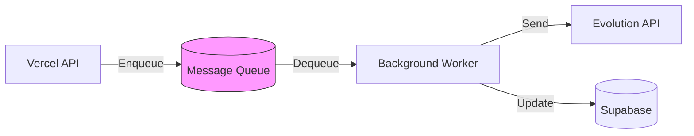
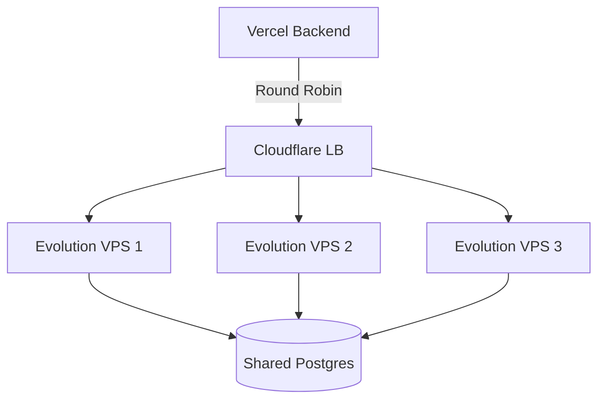

# Architecture Improvements & Recommendations

## Executive Summary
After analyzing the current architecture and existing codebase patterns, I've identified several strategic improvements that will enhance scalability, reliability, and operational efficiency.

## 1. Message Queue System (High Priority)

### Current Gap
The architecture relies on synchronous HTTP calls to Evolution API for message sending. This creates:
- **Tight coupling**: Frontend waits for WhatsApp delivery
- **Poor UX**: 2-5 second response times for message sends
- **No retry mechanism**: Failed sends are lost
- **Scalability bottleneck**: Can't handle burst traffic

### Proposed Solution: Async Message Queue


**Implementation Options:**
1. **Supabase Realtime + pg_cron** (Recommended - No extra cost)
   - Use `outbox` table pattern
   - pg_cron polls every 10 seconds
   - Pros: Free, simple, already have Supabase
   - Cons: Max 10s latency

2. **Vercel Cron + Supabase Queue Table**
   - Vercel cron (every 1 min) processes queue
   - Pros: Zero infrastructure
   - Cons: 1 min latency

3. **Upstash Redis Queue** (Best for scale)
   - Use BullMQ or Quirrel
   - Pros: <1s latency, built-in retries, dead letter queue
   - Cons: $10/month

**Recommendation**: Start with Option 1, migrate to Option 3 when >100 messages/min.

### Schema Addition
```sql
CREATE TABLE message_queue (
  id UUID PRIMARY KEY DEFAULT uuid_generate_v4(),
  number_id UUID REFERENCES numbers(id),
  recipient TEXT NOT NULL,
  content JSONB NOT NULL, -- {text, media, etc}
  status TEXT DEFAULT 'pending', -- pending, processing, sent, failed
  attempts INT DEFAULT 0,
  max_attempts INT DEFAULT 3,
  scheduled_for TIMESTAMPTZ DEFAULT NOW(),
  created_at TIMESTAMPTZ DEFAULT NOW(),
  processed_at TIMESTAMPTZ,
  error_message TEXT
);

CREATE INDEX idx_queue_pending ON message_queue(status, scheduled_for) 
  WHERE status = 'pending';
```

## 2. Database Optimizations

### 2.1 Connection Pooling
**Issue**: Vercel serverless functions create new DB connections per request.

**Solution**: Use Supabase connection pooler
```javascript
// api/_utils/db.js
import { createClient } from '@supabase/supabase-js'

export const supabaseAdmin = createClient(
  process.env.SUPABASE_URL,
  process.env.SUPABASE_SERVICE_ROLE_KEY,
  {
    db: {
      schema: 'public',
    },
    auth: {
      autoRefreshToken: false,
      persistSession: false,
    },
    global: {
      headers: { 'x-connection-pool': 'transaction' } // Use pooler
    }
  }
)
```

### 2.2 Read Replicas (Future)
For read-heavy operations (chat history, message search):
- Use Supabase read replicas (when available)
- Route GET requests to replica, POST/PUT to primary

### 2.3 Materialized Views for Analytics
```sql
-- Refresh every hour via pg_cron
CREATE MATERIALIZED VIEW message_stats_hourly AS
SELECT 
  DATE_TRUNC('hour', timestamp) as hour,
  number_id,
  COUNT(*) as message_count,
  COUNT(*) FILTER (WHERE is_from_me) as sent_count,
  COUNT(*) FILTER (WHERE NOT is_from_me) as received_count
FROM messages
GROUP BY 1, 2;

CREATE UNIQUE INDEX ON message_stats_hourly(hour, number_id);
```

## 3. Caching Strategy

### 3.1 API Response Caching
**Target**: Number list, user profile, plan limits

**Implementation**: Vercel Edge Config or Upstash Redis
```javascript
// api/_utils/cache.js
import { kv } from '@vercel/kv'

export async function getCached(key, ttl, fetchFn) {
  const cached = await kv.get(key)
  if (cached) return cached
  
  const fresh = await fetchFn()
  await kv.setex(key, ttl, fresh)
  return fresh
}

// Usage in api/v1/numbers.js
const numbers = await getCached(
  `numbers:${userId}`,
  300, // 5 min TTL
  () => supabaseAdmin.from('numbers').select('*').eq('user_id', userId)
)
```

### 3.2 QR Code Caching
Evolution API generates QR codes dynamically. Cache them:
```javascript
// Cache QR base64 in Vercel KV for 2 minutes
await kv.setex(`qr:${instanceName}`, 120, qrBase64)
```

## 4. Provider Abstraction Enhancements

### 4.1 Provider Registry Pattern
Instead of factory function, use a registry for extensibility:

```javascript
// api/_utils/providers/registry.js
class ProviderRegistry {
  constructor() {
    this.providers = new Map()
  }
  
  register(name, ProviderClass) {
    this.providers.set(name, ProviderClass)
  }
  
  get(providerName, config) {
    const ProviderClass = this.providers.get(providerName)
    if (!ProviderClass) throw new Error(`Unknown provider: ${providerName}`)
    return new ProviderClass(config)
  }
}

export const registry = new ProviderRegistry()

// Auto-register
import { EvolutionProvider } from './evolution.js'
import { GreenAPIProvider } from './greenapi.js'

registry.register('evolution', EvolutionProvider)
registry.register('green-api', GreenAPIProvider)
```

**Benefit**: Easy to add new providers (e.g., Twilio, official WhatsApp Business API)

### 4.2 Provider Health Monitoring
```javascript
// Each provider implements
class BaseProvider {
  async healthCheck() {
    // Return { healthy: boolean, latency: number, error?: string }
  }
}

// Vercel Cron calls this every 5 min
// api/cron/provider-health.js
const providers = ['evolution', 'green-api']
for (const name of providers) {
  const provider = registry.get(name, config)
  const health = await provider.healthCheck()
  
  await supabaseAdmin.from('provider_health').insert({
    provider: name,
    healthy: health.healthy,
    latency_ms: health.latency,
    checked_at: new Date()
  })
}
```

## 5. Horizontal Scaling for Evolution API

### 5.1 Multi-VPS Architecture
**Problem**: Single VPS = single point of failure

**Solution**: Load balancer + multiple Evolution instances


**Implementation**:
1. Deploy 3x VPS (4GB each)
2. Shared Postgres (managed - DigitalOcean/Supabase)
3. Cloudflare Load Balancer (free tier)
4. Sticky sessions by `instance_id` (hash-based routing)

**Cost**: $15/month (3x $5 VPS) vs. $60/month (1x 12GB VPS)

### 5.2 Instance Sharding
Store `vps_id` in `numbers` table:
```sql
ALTER TABLE numbers ADD COLUMN vps_id TEXT;
```

Route requests to correct VPS:
```javascript
const vpsUrl = getVPSForInstance(number.vps_id)
await fetch(`${vpsUrl}/message/sendText/${instanceName}`, ...)
```

## 6. Advanced Monitoring & Observability

### 6.1 Distributed Tracing
Use OpenTelemetry to trace requests across Vercel → Evolution → WhatsApp

```javascript
import { trace } from '@opentelemetry/api'

const tracer = trace.getTracer('whatsapp-saas')

export async function sendMessage(to, text) {
  return tracer.startActiveSpan('sendMessage', async (span) => {
    span.setAttribute('recipient', to)
    
    try {
      const result = await evolutionAPI.send(...)
      span.setStatus({ code: SpanStatusCode.OK })
      return result
    } catch (error) {
      span.recordException(error)
      span.setStatus({ code: SpanStatusCode.ERROR })
      throw error
    } finally {
      span.end()
    }
  })
}
```

### 6.2 Real-time Dashboards
Create admin dashboard showing:
- Active instances by provider
- Message throughput (live chart)
- Error rate (last 1h)
- Average latency by provider
- Top 10 users by message volume

**Tech Stack**: React + Recharts + Supabase Realtime subscriptions

## 7. Cost Optimization

### 7.1 Tiered Provider Strategy
```javascript
// Automatically route based on user plan
function getOptimalProvider(user) {
  if (user.plan === 'Free') return 'green-api' // Simpler, no VPS maintenance
  if (user.plan === 'Pro') return 'evolution'  // Cost-effective at scale
  if (user.plan === 'Agency') return 'evolution' // Unlimited instances
}
```

### 7.2 Lazy Instance Provisioning
Don't create Evolution instances until first message send:
```javascript
// On "Add Number" → Just store in DB with status='not_provisioned'
// On first message send → Provision instance, show QR, send message
```

**Savings**: Avoid idle instances consuming RAM

### 7.3 Auto-Cleanup
```sql
-- Delete instances inactive for 90 days
DELETE FROM numbers 
WHERE provider = 'evolution' 
  AND last_seen < NOW() - INTERVAL '90 days'
  AND status = 'disconnected';
```

## 8. Security Enhancements

### 8.1 API Key Rotation
```javascript
// Allow users to rotate API keys
POST /api/v1/auth/rotate-key
Response: { new_key: "sk_..." }

// Invalidate old key after 24h grace period
```

### 8.2 Webhook IP Whitelisting
```javascript
// Only accept webhooks from known VPS IPs
const ALLOWED_IPS = process.env.EVOLUTION_VPS_IPS.split(',')

if (!ALLOWED_IPS.includes(req.headers['x-forwarded-for'])) {
  return res.status(403).json({ error: 'Forbidden' })
}
```

### 8.3 Rate Limiting per User
```javascript
// Current: Global rate limit
// Improved: Per-user rate limit based on plan

const limits = {
  'Free': { messages: 100, window: '1d' },
  'Pro': { messages: 10000, window: '1d' },
  'Agency': { messages: -1 } // Unlimited
}
```

## 9. Developer Experience (DX)

### 9.1 Local Development with Mock Provider
```javascript
// api/_utils/providers/mock.js
export class MockProvider extends BaseProvider {
  async sendMessage(to, text) {
    console.log(`[MOCK] Sending to ${to}: ${text}`)
    return { id: 'mock-' + Date.now() }
  }
}

// Use in development
if (process.env.NODE_ENV === 'development') {
  registry.register('mock', MockProvider)
}
```

### 9.2 Provider Playground
Create `/admin/provider-test` page:
- Select provider
- Enter test number
- Send test message
- View raw API response

## 10. Migration Path

### Phase 1: Foundation (Week 1-2)
- ✅ Implement provider registry
- ✅ Add message queue table
- ✅ Set up caching layer

### Phase 2: Reliability (Week 3-4)
- ✅ Implement async message processing
- ✅ Add circuit breakers
- ✅ Set up health monitoring

### Phase 3: Scale (Month 2)
- ✅ Deploy multi-VPS setup
- ✅ Implement instance sharding
- ✅ Add distributed tracing

### Phase 4: Optimization (Month 3)
- ✅ Implement tiered provider strategy
- ✅ Add auto-cleanup jobs
- ✅ Optimize database queries

## Summary of Key Improvements

| Improvement | Impact | Effort | Priority |
|:---|:---|:---|:---|
| Message Queue | High (reliability) | Medium | 🔴 Critical |
| Provider Registry | Medium (extensibility) | Low | 🟡 High |
| Caching Layer | Medium (performance) | Low | 🟡 High |
| Connection Pooling | Low (cost savings) | Low | 🟢 Medium |
| Multi-VPS | High (availability) | High | 🟢 Medium |
| Distributed Tracing | Medium (debugging) | Medium | 🔵 Low |
| Auto-Cleanup | Low (cost) | Low | 🔵 Low |

## Recommended Next Steps

1. **Immediate** (This week):
   - Implement provider registry pattern
   - Add basic caching for number lists
   - Set up connection pooling

2. **Short-term** (Next 2 weeks):
   - Build message queue system
   - Implement health monitoring
   - Add circuit breakers

3. **Medium-term** (Next month):
   - Deploy second VPS for redundancy
   - Implement distributed tracing
   - Build admin monitoring dashboard

4. **Long-term** (Next quarter):
   - Evaluate official WhatsApp Business API as 3rd provider
   - Implement AI-powered message routing
   - Build analytics platform
