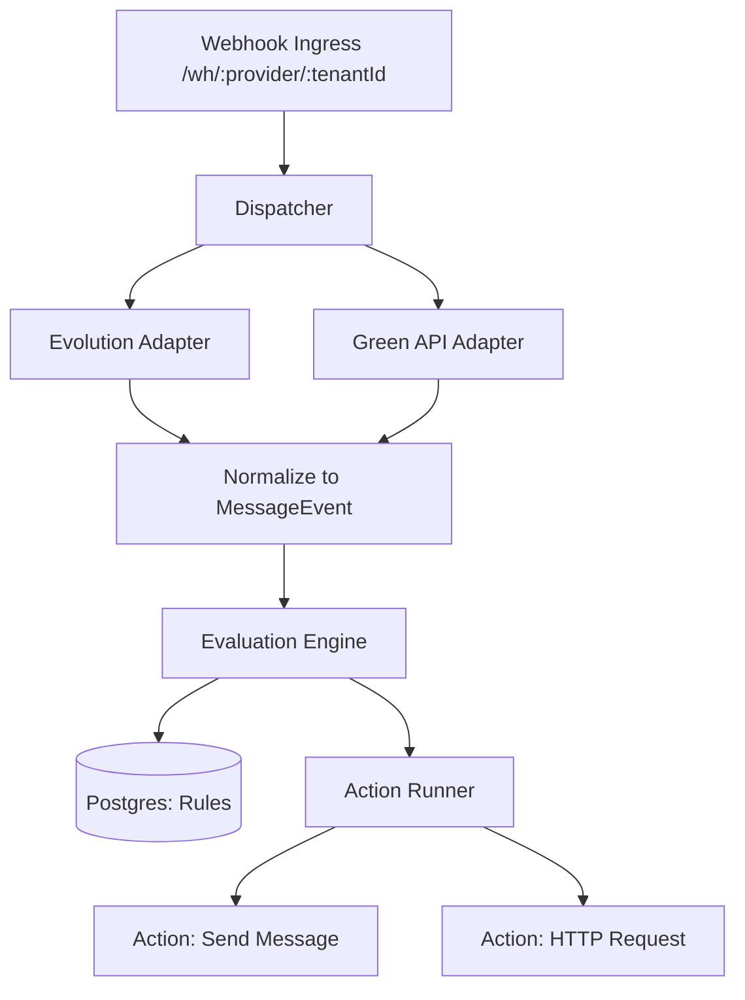

# SDD - Multi-Provider Automation Engine

Technical design for a scalable, multi-tenant automation system supporting Evolution API and Green API.

## 1. System Architecture

The system follows a **Dispatcher-Adapter** pattern to handle multiple providers.

## 2. Data Schema (PostgreSQL)

### `tenants`
Stores isolation data and unique secrets.
- `id`: UUID (Primary Key)
- `name`: string
- `webhook_secret`: string (used in URL validation)

### `automations`
Stores user-defined rules.
- `id`: Serial
- `tenant_id`: UUID (Foreign Key)
- `name`: string
- `enabled`: boolean
- `trigger`: JSONB
  - `{ "provider": "any", "text_contains": "hello" }`
- `actions`: JSONB (Array)
  - `[ { "type": "send_message", "params": { "text": "Hi!" } } ]`

## 3. Webhook Dispatcher
Unique URLs ensure instant tenant identification:
`https://evolution.builders-tech.com/wh/{{provider}}/{{tenant_id}}/{{secret}}`

1. **Validation**: Check if `:tenant_id` exists and `:secret` matches.
2. **Parsing**: Use the `:provider` param to select the correct parser.
3. **Queueing**: Push to internal memory (or Redis) for async processing.

## 4. Action Runner
A modular service to execute automated tasks.

### Action: `send_message`
- **Logic**: Calls the existing `evolutionService` or a future `greenApiService`.
- **Params**: `text` (required), `media_url` (optional).

### Action: `http_request`
- **Logic**: Uses `axios` to fire a webhook to an external system.
- **Params**: `url`, `method` (POST/GET), `headers`, `payload` (JSON).

## 5. Local Testing UI
Added to the existing `/admin` panel.
- **Automations Tab**: Lists current rules.
- **Test Trigger**: A button to simulate a webhook payload to test if a rule fires correctly.

---
[[PRD-EvolutionBackend]] | [[Roadmap]]
